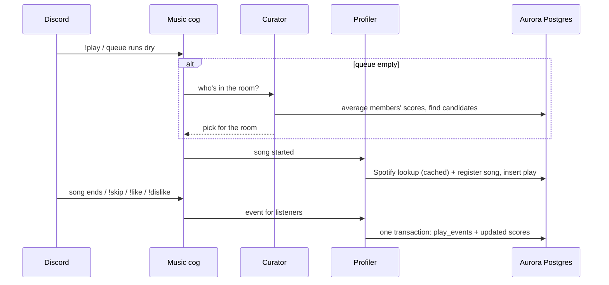

# DaMuse

A Discord music bot that builds a **shared taste profile for a voice channel** — instead of
playing one person's queue, it blends the combined listening history of everyone currently
sitting in the call and curates around that.

> **Status: work in progress.** The core preference pipeline (below) is built and running against
> live infrastructure; the piece that turns a group's taste profile into an actual playback queue
> is still being wired up. See [Where this is headed](#where-this-is-headed).

---

## The idea

Most "music bot" playlists are really just one person's queue that everyone else has to sit
through. DaMuse tracks what *every* member of a voice channel tends to like — at the song,
artist, and genre level — and maintains a running average of the room's taste for as long as
they're in the call together. Someone joins, their preferences fold into the mix; someone
leaves, theirs fade back out. The goal is a bot that reflects whoever's actually listening right
now, not whoever happened to type `!play` first.

## How the pipeline works



- **Postgres (Aurora)** is the only store. Every play is a row in `plays`, and every listener
  reaction (heard it through, skipped, liked, disliked) is a row in `play_events`. Each event
  updates that listener's song / artist / genre `preference_score` in the same transaction, as a
  moving average toward liked (1) or disliked (0). Explicit feedback moves it more than passive
  listening.
- A nightly `pg_cron` job decays untouched scores back toward neutral (0.5), so old likes fade to
  "no opinion" rather than lingering forever.
- The **Curator** is stateless. It reads who's in the voice channel from Discord, averages their
  scores in SQL (members with no history for an item count as neutral), pulls songs connected to
  what the room likes, skips anything played there recently, and picks one at random, weighted
  toward the best matches.

## Architecture

| Layer | What lives there |
|---|---|
| `cogs/` | Discord-facing commands and listeners: `!play` / `!skip` / `!stop` / `!like` / `!dislike`, and registering members as they join voice |
| `utils/` | `Curator` (group taste and picks), `Profiler` (plays, events, scoring), `Librarian` (registers users / songs / artists / genres) |
| `music_state/` | Per-guild playback state and the inactivity timer |
| `db/` | Async Postgres access (`asyncpg`), plus the decay-job installer |
| `api/` | Spotify Web API (metadata), `yt-dlp` (finding and streaming audio), and the S3 audio cache |
| `worker.py` | Downloads songs, converts them to Ogg Opus, and uploads them to S3 |

Built entirely `async`: `discord.py` for the gateway, `asyncpg` for Postgres, blocking Spotify
and S3 calls pushed to threads, and `yt-dlp` extraction offloaded to a process pool so nothing
blocks the event loop.

### Audio cache

Every song played gets cached in S3 as an Ogg Opus file, Discord's native voice format:

1. On `!play` (or a Curator pick), the bot finds the YouTube video id and sends a HEAD request
   to S3 for `audio/youtube/<id>.opus`.
2. **Cached:** the bot plays the file from S3 through a signed URL. ffmpeg passes the Opus audio
   straight through without re-encoding, so the bot does almost no audio work.
3. **Not cached:** this one time it streams from YouTube, and the song is added to the
   `audio_jobs` queue in Postgres.
4. `worker.py` (run as many copies as you like, anywhere with ffmpeg) claims the job, downloads
   the audio, converts it to Opus and uploads it. YouTube's audio is usually Opus already, so
   that's a lossless container change rather than a re-encode.

Spotify track links work as input too, but only for finding the song on YouTube. Spotify doesn't
provide full audio.

### A couple of things worth pointing out

- **Password-less database auth.** Rather than a static DB password, the bot authenticates to an
  IAM-authenticated Aurora Postgres cluster with a signed AWS token, re-generated for every new
  physical connection the pool opens (tokens are only valid ~15 minutes, so a single token at
  startup wouldn't survive the pool's lifetime). `asyncpg` supports this natively — `password` can
  be an async callable it invokes per connection, which is what makes this work cleanly.
- **One mapping drives both directions.** A single table (`PREFERENCE_TABLE_MAPPING`) declares how
  each of the three preference tables joins back to its entity table. Every query that reads
  preferences and every upsert that writes them derives from that one mapping, instead of three
  copies of near-identical SQL.

## Running it

Dependencies are managed with [Poetry](https://python-poetry.org/) (2.x). `poetry.toml`
keeps the virtualenv in `./.venv`, so IDEs and `Activate.ps1` still find it.

```powershell
pipx install poetry          # once (or see Poetry's docs for other installers)
poetry install               # runtime + dev dependencies, exactly as locked

poetry run python main.py    # the bot (needs .env, Postgres, ffmpeg)
poetry run python worker.py  # the S3 audio-cache worker (needs AUDIO_BUCKET)

poetry run pytest            # integration tests also need TEST_DATABASE_URL
poetry run mypy .
poetry run black .
poetry run flake8
```

Changing dependencies: `poetry add <pkg>` / `poetry add --group dev <pkg>`,
`poetry update <pkg>` to upgrade within the ranges in `pyproject.toml`. Commit `poetry.lock`.

## Tech stack

`discord.py` · `asyncpg` + Aurora PostgreSQL (IAM auth) · S3 (Ogg Opus audio cache) · Spotify
Web API · `yt-dlp` + ffmpeg · `boto3` · Python 3.13

## Where this is headed

What's built: join → play → record → score → curate, against live AWS infrastructure (Aurora +
IAM auth). When the queue runs dry, the bot picks the next song from the room's blended taste.

What's next:
- Map Curator picks straight to their cached audio (song → audio key), so picks skip the
  YouTube search.
- Multi-process sharding (`shard_ids` per process) plus RDS Proxy once the guild count calls
  for it.
- Richer curation signals (time of day, who else is in the room) from the `play_events` history.
